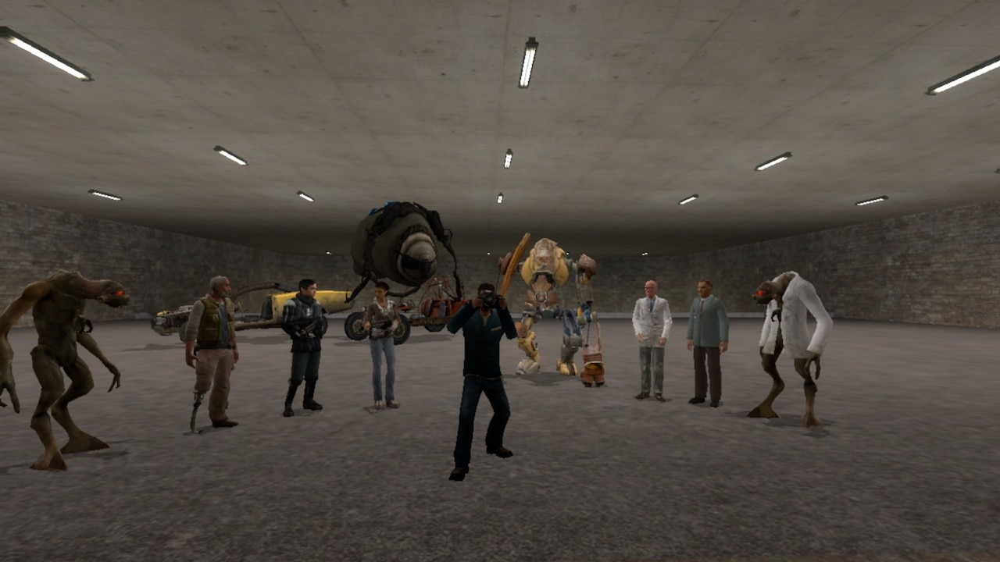
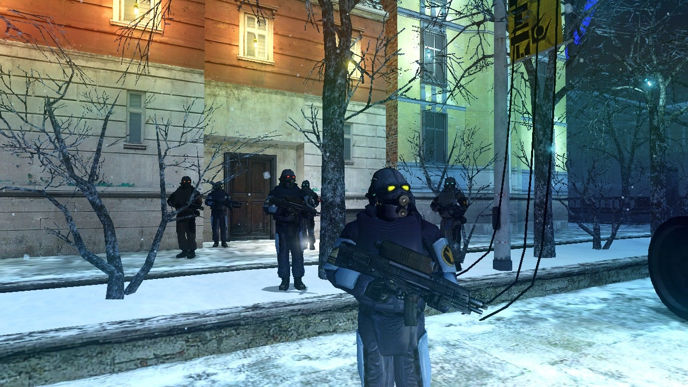
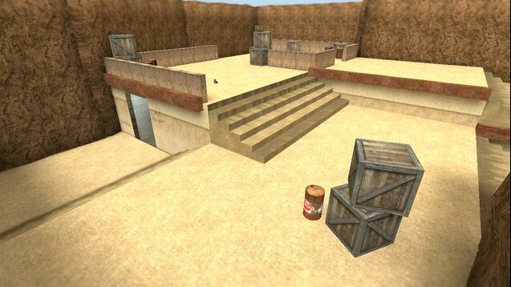

<head><link rel="stylesheet" href="/assets/css/style.css"></head>
# Garry's Mod
*[Return Home](index.md)*  
I frequently play Garry's mod. Garry's mod is a blank slate for me to put my ideas into. I make [Deathmatch Maps](hammer.md#deathmatch-maps) for Garry's mod.  
### Garry's Mod Screenshots
These are some screenshots that I took while playing Garry's Mod:
 
 

 
 

 
 

 
 
