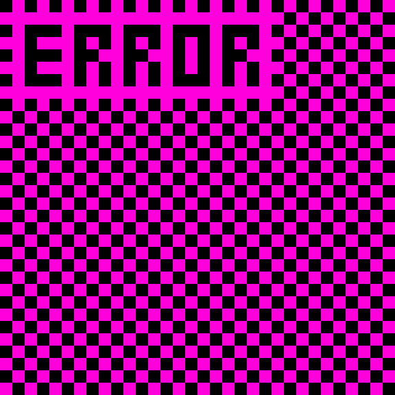

# My Music
*[Return Home](index.md)* 
I make electronic music for fun to mimic the style of [Kelly Bailey](https://en.wikipedia.org/wiki/Kelly_Bailey_(composer)). I use deep synths and electronic tones to make the music sound industrial. I often use echoing drone sound effects to make the music have a certain vibe.
 
This is the current cover for my album titled Antiquated Beat: 

 
*It's not a real error.*
 
 
This is my piece titled *Mori in Conatu* meaning *Die Trying* in Latin. I hope to use it in a game someday. I composed the score and generated it by hand for the Antiquated Beat album.
 
<audio controls>
  <source src="mori-in-conatu.mp3" type="audio/mpeg">
  Your browser does not support the audio element.
</audio>
 
 
This is my piece titled *Extraterrestrial Lick Back*. The title highlights the underlying whimsical tune inside of the dark synths, similair to a multidimensional being doing something childish and foolhardy. I composed the score and generated it by hand for the Antiquated Beat album.
 
<audio controls>
  <source src="Extraterrestrial Lick Back.mp3" type="audio/mpeg">
  Your browser does not support the audio element.
</audio>
 
 
This is my piece titled *Kelly 2*. It uses an internal name it had for a while, so I decided to keep it.
 
<audio controls>
  <source src="Kelly2.mp3" type="audio/mpeg">
  Your browser does not support the audio element.
</audio>
 
<a href="https://fieryfork.github.io/mymusic.html">Mori in Conatu</a> © 2025 by <a href="https://fieryfork.github.io/">Fieryfork</a> is licensed under <a href="https://creativecommons.org/licenses/by-nc/4.0/">CC BY-NC 4.0</a>
 
<a href="https://fieryfork.github.io/mymusic.html">Extraterrestrial Lick Back</a> © 2025 by <a href="https://fieryfork.github.io/">Fieryfork</a> is licensed under <a href="https://creativecommons.org/licenses/by-nc/4.0/">CC BY-NC 4.0</a>
 
<a href="https://fieryfork.github.io/mymusic.html">Kelly 2</a> © 2025 by <a href="https://fieryfork.github.io/">FieryFork</a> is licensed under <a href="https://creativecommons.org/licenses/by-nc/4.0/">CC BY-NC 4.0</a>
